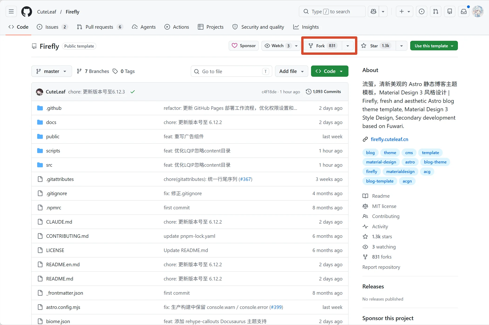
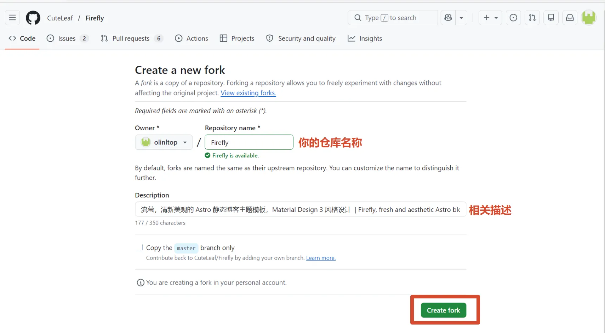
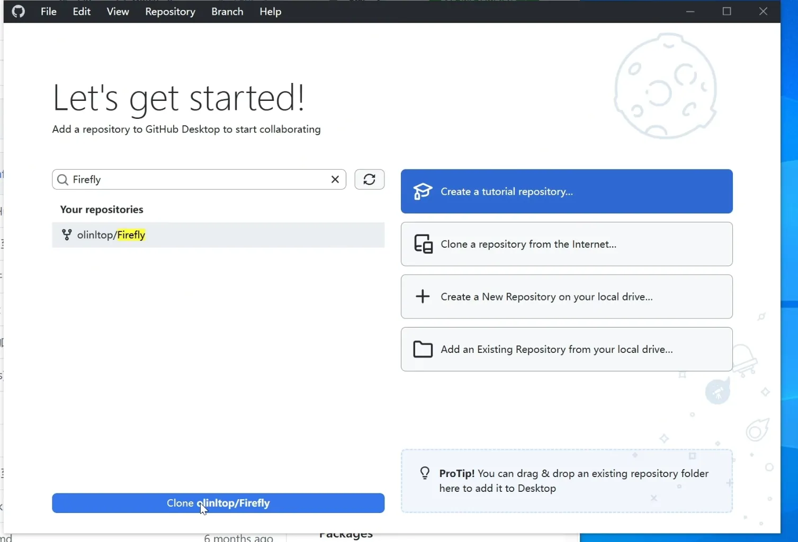

完成本地环境准备后，下一步就是把 Firefly 官方仓库复制到自己的 GitHub 账号下，再克隆到电脑里进行配置修改、文章编写和后续部署。这个过程通常分为两段：先在 GitHub 上 Fork 仓库，再用 GitHub Desktop 拉取代码。

## 准备工作

开始之前，请先确认已经准备好下面这些内容：

- 一个可以正常登录的 GitHub 账号。
- 已经安装并登录 GitHub Desktop。
- 本地已经安装 Node.js、pnpm 和 Git。
- 电脑中准备好一个用于存放项目的目录。

如果前面的环境还没有准备好，可以先完成 Node.js、pnpm、Git、GitHub Desktop 和 VS Code 的安装，再继续进行仓库克隆。

## 打开 Firefly 官方仓库

在浏览器中打开 Firefly 官方仓库：

[https://github.com/CuteLeaf/Firefly](https://github.com/CuteLeaf/Firefly)

Firefly 是一个清新美观的 Astro 静态博客主题模板，采用 Material Design 3 风格设计，并基于 Fuwari 进行二次开发。进入仓库首页后，可以看到代码列表、项目说明、Star、Fork、许可证等信息。

接下来，点击页面右上方的 **Fork** 按钮，开始创建属于自己的 Firefly 仓库副本。



## 创建自己的 Fork 仓库

进入 **Create a new fork** 页面后，需要检查或填写以下信息：

- **Owner**：选择自己的 GitHub 账号或组织。
- **Repository name**：填写仓库名称，默认通常是 `Firefly`，也可以改成自己喜欢的名称。
- **Description**：仓库描述会从官方仓库自动带入，可以按需保留或修改。
- **Copy the master branch only**：一般保持默认即可，只复制主分支更简洁。

确认信息无误后，点击页面下方的 **Create fork** 按钮。GitHub 会自动创建仓库副本，完成后会跳转到你自己的仓库页面。



Fork 完成后，浏览器地址栏里的仓库地址会变成类似下面这样的格式：

```text
https://github.com/你的用户名/Firefly
```

这说明你已经拥有了自己的 Firefly 仓库。后续修改配置、编写文章、提交代码和部署站点，都应该在自己的仓库中完成，而不是直接修改官方仓库。

## 使用 GitHub Desktop 克隆仓库

现在仓库已经 Fork 到自己的账号下，接下来需要把代码克隆到本地电脑。

打开 GitHub Desktop，在左侧仓库列表或搜索框中输入 `Firefly`。找到刚刚 Fork 的仓库后，点击下方的 **Clone** 按钮。



随后 GitHub Desktop 会让你选择本地保存目录。建议选择一个路径清晰、方便管理的位置，例如：

```text
D:\Projects\Firefly
```

或：

```text
E:\Documents\GitHub\Firefly
```

选择完成后，GitHub Desktop 会自动拉取仓库代码。克隆完成后，你就可以用 VS Code 或其他编辑器打开这个项目目录。

## 安装依赖并启动项目

进入 Firefly 项目目录后，打开终端，先安装依赖：

```bash title="Terminal window"
pnpm install
```

依赖安装完成后，启动本地开发服务：

```bash title="Terminal window"
pnpm dev
```

终端中出现本地访问地址后，在浏览器中打开它，一般是：

```text
http://localhost:4321
```

如果页面可以正常打开，说明 Firefly 已经在本地运行成功。

## 开始修改配置和编写文章

克隆并运行成功后，就可以开始把 Firefly 改成自己的博客。常见的修改入口包括：

- `src/config/siteConfig.ts`：站点标题、描述、语言、导航等基础信息。
- `src/config/profileConfig.ts`：个人头像、昵称、简介和社交链接。
- `src/content/posts`：博客文章目录，可以新增或修改 Markdown 文章。
- `src/assets/images`：站点中使用的源图片资源。
- `public`：需要直接作为静态文件访问的资源。

修改完成后，可以在 GitHub Desktop 中查看文件变更，填写提交信息并创建 commit。确认本地效果没有问题后，再把修改推送到 GitHub 仓库。

## 常见问题

### 找不到刚刚 Fork 的仓库

可以在 GitHub Desktop 中点击刷新按钮，或者确认当前登录的是 Fork 时使用的同一个 GitHub 账号。

### Clone 按钮不可用

检查 GitHub Desktop 是否已经登录账号。如果仍然无法操作，可以在 GitHub 仓库页面点击绿色的 **Code** 按钮，复制 HTTPS 地址，再回到 GitHub Desktop 选择从 URL 克隆。

### 本地运行失败

优先检查 Node.js 和 pnpm 版本，并确认是在 Firefly 项目根目录中执行命令。项目依赖安装异常时，可以重新执行：

```bash title="Terminal window"
pnpm install
```

然后再次运行：

```bash title="Terminal window"
pnpm dev
```

到这里，你已经完成了从 Fork 官方仓库到本地运行 Firefly 的完整流程。接下来就可以继续修改站点信息、替换头像与封面、编写自己的第一篇博客文章了。
