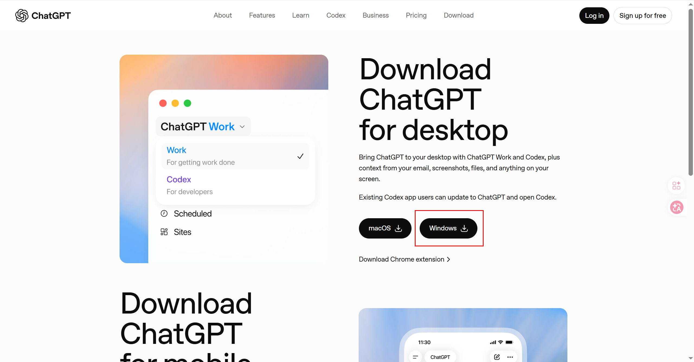
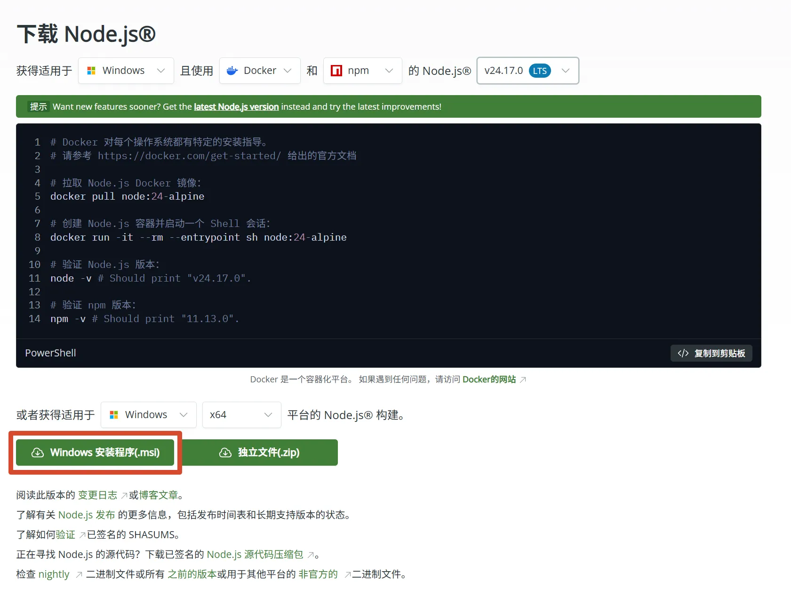
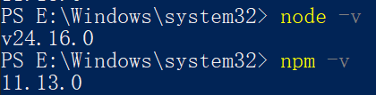
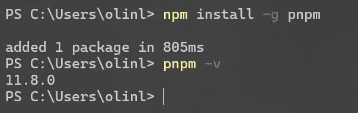
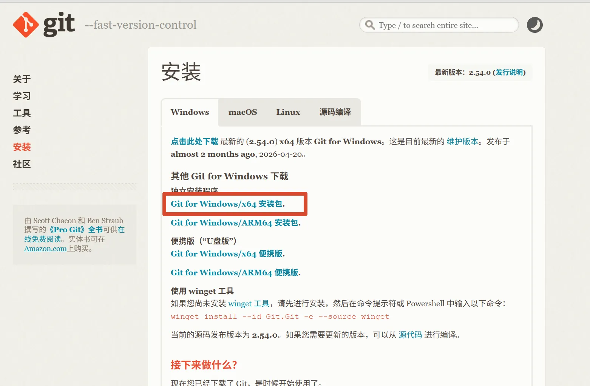
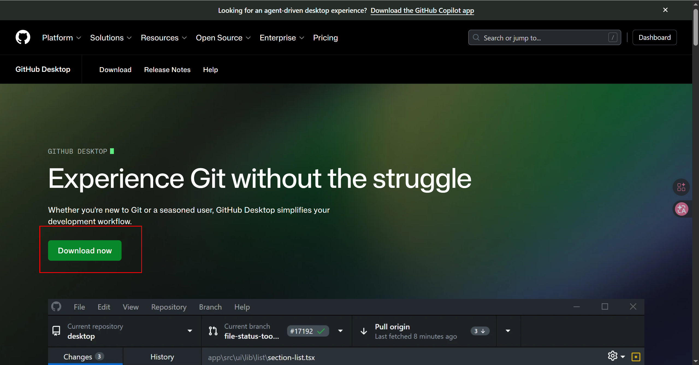
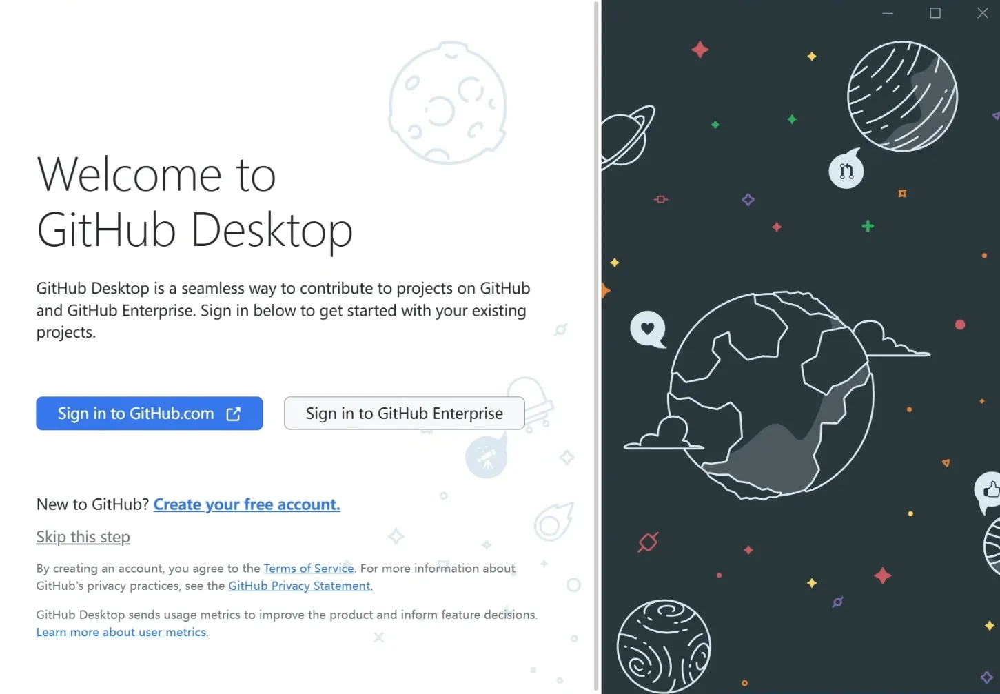
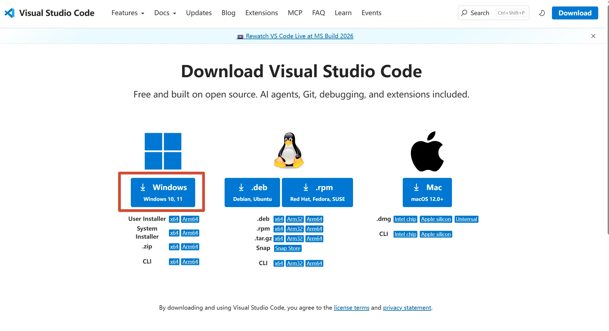

安装工具不是学习 AI 编程的终点，而是让后续每个动作都能够执行和验证的基础。本篇只解决一个主题：在 Windows 电脑上准备 Firefly 所需的 AI 编程工具。

工具安装完成后，你应该能够打开 ChatGPT，使用终端检查 Node.js、npm、pnpm 和 Git 的版本，使用 GitHub Desktop 管理仓库，并用 VS Code 修改项目文件。

## 问题是什么

“我要开始 AI 编程”仍然太模糊。安装工具这一步需要把目标写成可以检查的问题：

> 我使用 Windows 电脑，准备学习 AI 编程并运行 Firefly。请安装 ChatGPT 桌面端、Node.js LTS、pnpm、Git、GitHub Desktop 和 VS Code，并逐项告诉我如何验证安装成功。

这句话包含了本篇任务的五个边界：

| 要素 | 本篇内容 |
| --- | --- |
| 目标 | 准备可以进行 AI 编程和 Firefly 开发的电脑环境 |
| 输入 | Windows 电脑、网络、GitHub 账号和安装权限 |
| 工具 | ChatGPT、Node.js、pnpm、Git、GitHub Desktop、VS Code |
| 约束 | Node.js 版本不低于 22，项目使用 pnpm |
| 验收 | 每个工具都能打开或在终端输出可识别的版本信息 |

本篇不处理 Fork 仓库、安装项目依赖或启动 Firefly。工具都准备好以后，再进入下一篇：[Fork 和克隆 Firefly](/posts/fork-firefly-and-clone/)。

## 适用环境是什么

本文适用于下面的环境：

- Windows 10 或 Windows 11。
- 可以访问 ChatGPT、Node.js、GitHub 和 VS Code 官方网站。
- 拥有安装软件的权限。
- 准备使用 PowerShell、Windows Terminal 或 VS Code 集成终端。
- 使用 Node.js 22 或更高版本的 LTS 版本。

工具的职责不同，不要把它们混为一个软件：

| 工具 | 用途 |
| --- | --- |
| ChatGPT 桌面端 | 说明问题、拆分任务、分析报错和辅助编程 |
| Node.js | 运行 Astro、脚本和前端开发工具 |
| npm | 随 Node.js 安装的包管理器，用来安装 pnpm |
| pnpm | Firefly 项目指定的依赖安装和脚本执行工具 |
| Git | 记录文件变化、提交代码和与远程仓库同步 |
| GitHub Desktop | 用图形界面管理 GitHub 仓库 |
| VS Code | 查看项目文件、修改配置和编写 Markdown |

## 具体怎么做

### 1. 安装 ChatGPT 桌面端

打开 [ChatGPT 官方下载页面](https://chatgpt.com/download/)，下载适合当前 Windows 系统的安装程序。



安装完成后打开 ChatGPT，并登录自己的账号。新建一个“AI 编程学习”对话，后续可以把项目路径、命令输出和完整报错集中记录在这里。

第一次提问可以使用这段文字：

```text
我准备在 Windows 上学习 AI 编程，并运行 Firefly 博客。
请先帮我检查需要准备哪些工具，但一次只给我一个最小执行步骤，
并告诉我每一步如何验证完成。
```

### 2. 安装 Node.js

打开 [Node.js 官方下载页面](https://nodejs.org/zh-cn/download)，选择 LTS 稳定版。Firefly 当前要求 Node.js 主版本不低于 22。



运行安装程序，保持默认选项完成安装。安装结束后，关闭原来的终端窗口并重新打开 PowerShell，执行：

```powershell title="检查 Node.js 和 npm"
node --version
npm --version
```



确认第一条命令输出的 Node.js 主版本是 `22` 或更高。

### 3. 安装 pnpm

Node.js 安装完成后，系统会同时提供 npm。使用 npm 全局安装项目使用的 pnpm：

```powershell title="安装 pnpm"
npm install --global pnpm@9.14.4
```

然后检查 pnpm 版本：

```powershell title="检查 pnpm"
pnpm --version
```



如果能输出版本号，说明终端已经可以识别 pnpm。Firefly 后续的依赖安装、开发和构建命令都应使用 pnpm。

### 4. 安装 Git

打开 [Git 官方下载页面](https://git-scm.com/downloads)，下载 Git for Windows 安装包。安装时保持默认选项即可。



安装完成后重新打开终端，执行：

```powershell title="检查 Git"
git --version
```

Git 用于克隆 Firefly、查看文件变化、创建提交以及推送到 GitHub。

### 5. 安装并登录 GitHub Desktop

打开 [GitHub Desktop 官方下载页面](https://desktop.github.com/)，下载安装程序。安装完成后启动 GitHub Desktop，登录自己的 GitHub 账号。





登录后，确认界面能够显示当前账号。后续会使用 **Clone repository** 克隆 Firefly，使用 **Commit to master** 创建提交，并使用 **Push origin** 推送代码。

### 6. 安装并打开 VS Code

打开 [VS Code 官方下载页面](https://code.visualstudio.com/)，下载适合 Windows 的版本并完成安装。



安装完成后打开 VS Code。现在还没有 Firefly 项目目录，可以先确认 VS Code 能正常启动；克隆仓库后，再使用 **File → Open Folder** 打开 Firefly 根目录。

### 7. 建立工具检查记录

把版本和账号状态记录在自己的学习笔记中：

```text
操作系统：Windows
Node.js：
npm：
pnpm：
Git：
GitHub Desktop：已登录 / 未登录
VS Code：已打开 / 未打开
ChatGPT：已登录 / 未登录
```

不要只写“已经安装”。记录实际输出，后面遇到版本不匹配时才能快速定位问题。

## 如何验证完成

依次完成下面的检查：

- [ ] ChatGPT 桌面端可以打开。
- [ ] ChatGPT 账号已经登录。
- [ ] Node.js 主版本不低于 `22`。
- [ ] `npm --version` 能输出版本号。
- [ ] `pnpm --version` 能输出版本号。
- [ ] `git --version` 能输出版本号。
- [ ] GitHub Desktop 可以打开。
- [ ] GitHub Desktop 已登录自己的账号。
- [ ] VS Code 可以打开。
- [ ] 已记录所有工具的版本或登录状态。

也可以在 PowerShell 中一次执行下面的检查：

```powershell title="批量检查开发工具"
node --version
npm --version
pnpm --version
git --version
```

完成标准不是“安装程序运行结束”，而是：命令能够被终端识别、版本符合要求、图形工具能够打开并登录。

## 失败时先检查什么

### 终端提示“不是内部或外部命令”

先关闭当前终端，再打开一个新的 PowerShell 窗口，然后重新执行命令。安装程序通常会更新 PATH 环境变量，旧终端不会自动读取新配置。

如果仍然失败，按顺序检查：

1. 软件安装程序是否真的运行完成。
2. 是否打开了安装软件之后的新终端。
3. Windows 的应用执行别名是否产生了冲突。
4. PATH 中是否包含对应软件的安装目录。

### Node.js 版本低于 22

卸载或更新旧版本后，重新安装 Node.js LTS。不要通过修改项目配置绕过版本要求，因为后续构建可能仍然失败。

### pnpm 安装失败

先确认 `node --version` 和 `npm --version` 都能正常输出，再重新执行：

```powershell
npm install --global pnpm@9.14.4
```

如果 npm 报权限错误，可以使用管理员 PowerShell 重试；如果网络错误，先记录完整报错，再搜索具体错误信息。

### GitHub Desktop 无法登录

确认浏览器可以登录 GitHub，并检查 GitHub Desktop 是否使用了正确账号。不要把密码、验证码或访问令牌复制到聊天记录中。

### 不知道某个工具是否真的需要

回到工具职责表逐项判断：Node.js 和 pnpm 负责运行项目，Git 和 GitHub Desktop 负责管理代码，VS Code 负责编辑文件，ChatGPT 负责协助思考和排查。当前步骤只需完成工具准备，不需要提前学习所有功能。

如果每个工具都通过了独立验证，阶段 1 就完成了。下一步进入：[Fork 和克隆 Firefly](/posts/fork-firefly-and-clone/)。
